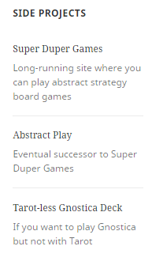

# Grav Blogroll Plugin

The **Blogroll** Plugin is for [Grav CMS](http://github.com/getgrav/grav). It allows you to maintain and selectively display a list of links.



> NOTE: The appearance will differ from the screen capture depending on your base theme. See the **Customization** section for instructions on how to change the styling.

# Installation

Installing the Blogroll plugin can be done in one of two ways. The GPM (Grav Package Manager) installation method enables you to quickly and easily install the plugin with a simple terminal command, while the manual method enables you to do so via a zip file.

## GPM Installation (Preferred)

The simplest way to install this plugin is via the [Grav Package Manager (GPM)](http://learn.getgrav.org/advanced/grav-gpm) through your system's terminal (also called the command line).  From the root of your Grav install type:

    bin/gpm install blogroll

This will install the Blogroll plugin into your `/user/plugins` directory within Grav. Its files can be found under `/your/site/grav/user/plugins/blogroll`.

## Manual Installation

To install this plugin, just download the zip version of this repository and unzip it under `/your/site/grav/user/plugins`. Then, rename the folder to `blogroll`. You can find these files either on [GitHub](https://github.com/Perlkonig/grav-plugin-blogroll) or via [GetGrav.org](http://getgrav.org/downloads/plugins#extras).

You should now have all the plugin files under

    /your/site/grav/user/plugins/blogroll
	
> NOTE: This plugin is a modular component for Grav which requires [Grav](http://github.com/getgrav/grav), the [Error](https://github.com/getgrav/grav-plugin-error) and [Problems](https://github.com/getgrav/grav-plugin-problems) plugins, and a theme to be installed in order to operate.

# Usage

To use `blogroll` you need to first create your lists of links, as described in the **Configuration** section below.

Then, wherever you want a list to appear in your theme (usually in `sidebar.html.twig`), `include` the twig file with the required paramters, along the following lines:

    ```
    
      <aside class="widget widget_meta">
        <h2 class="widget-title">{{'SIDE PROJECTS'|t}}</h2>
        
      </aside>
    

    ```

The following are parameters you can set in the `with` portion of your `include`. If they are not specified, then the system first looks in your config file and then just makes a guess.

  - `tags`: This is an array of at least one tag that relates to links in your config file. This is the only "required" field in that if nothing is passed, and a default isn't defined in your config, nothing will be displayed.

  - `combinator`: Is only used if there are at least two tags. If you pass `and`, then only links that contain *all* the provided tags will be displayed. Anything else will be interpreted as `or`.

  - `orderby`: This tells the system how you want your links sorted. The following are the recognized options, which should be self explanatory. Anything else is interpreted as `asis`, meaning not sorted. They'll appear in whatever order PHP decides.

    - `link`
    - `description`
    - `name`
    - `sortkey`

  - `asc`: If false, then the sorted list will be reversed.

# Configuration

> NOTE: I apologize but I am not versed enough in the Admin plugin and required `blueprints.yaml` code to support it. The only way to change the config is to edit the YAML directly. Pull requests are warmly welcomed!

To change the defaults, copy `blogroll.yaml` to your `user/config/plugins` folder and edit it there. You're going to have to do this at some point to create your list of links. But the copy only needs to include your overrides. You can delete the defaults from the copied file and just put in your links.

## Default Config

```
enabled: true
built_in_css: true
default_tags: []
default_orderby: 'asis'
default_combinator: 'or'
default_asc: true
```

- Use the `enabled` field to activate or deactivate the plugin.

- The `built_in_css` field tells the plugin to use the included CSS. To customize, set this to `false` and see the **Customization** section for further instructions.

- The other `default_*` fields, if given, will be used by the twig file if a field isn't passed in the `with` statement.

## Links

The `links` portion is where your actual links live. This is all you really need in your `user/config/plugins` copy of `blogroll.yaml`. It should be formatted as follows:

```
links:
  - name: Link 1
    description: "First link"
    link: "http://example.com/1"
    tags: [tag1]
    sortkey: ccc
  - name: Link 2
    description: "Second Link"
    link: "http://example.com/2"
    tags: [tag1,tag2]
    sortkey: bbb
  - name: Link 3
    description: "Third link"
    link: "http://example.com/3"
    tags: [tag1,tag2]
    sortkey: aaa    
```

- The `name` is what appears in the output.

- If provided, the `description` is displayed after the name.

- The `link` is self-explanatory. **The `link` field must be unique across your entire list!** The system won't complain or anything, but you will get undefined merging and sorting results otherwise.

- The `tags` field is how you generate individual lists. When you `include` the twig file you have to specify one or more tags. The system will pull those links out for display.

- The `sortkey` field is completely optional and will likely see little use. It's just a free-form key that you can sort on for those situations where you really want things to appear in a very exact order.

# Customization

You can customize both the CSS and the twig file.

## CSS

To customize the CSS, do the following:

  - Disable `built_in_css`.
  - Copy `blogroll.css` from the plugin's `assets` folder into the `assets` folder of your theme.
  - Edit as you see fit.

## Twig

To customize the twig file, do the following:

  - Copy `blogroll.html.twig` from the plugin's `templates/partials` folder into your theme's `templates/partials` folder.
  - Edit as you see fit.

